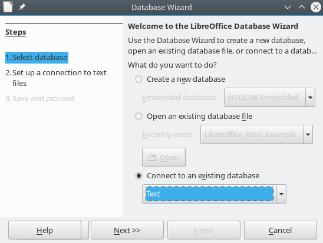
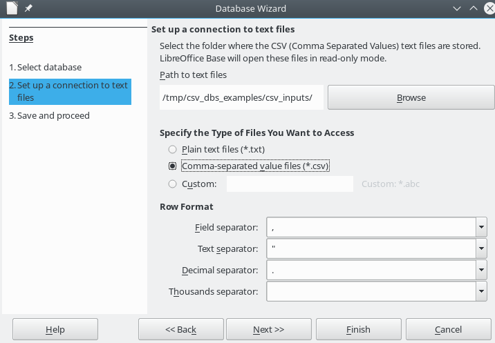
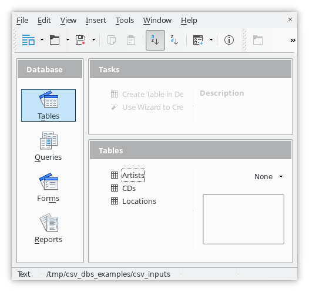
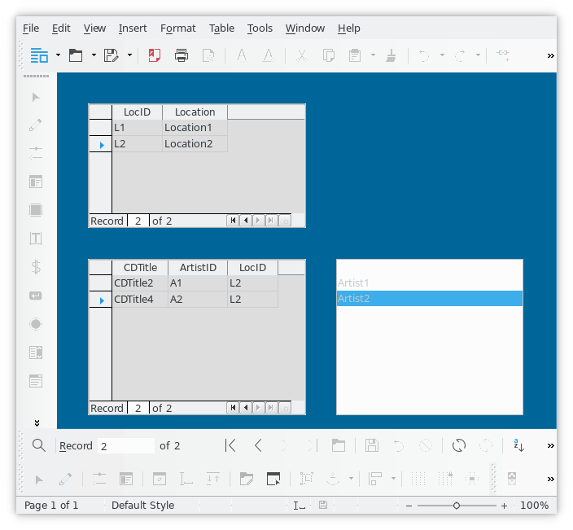

# csv_dbs_examples
It is CSV "DBs" examples.
Purpose is to have convenient set of CSV files for testing CSV imports and joins in other systems, like `csvsql` or Base,Kexi import, etc. Also to provide "hello world" examples from few systems for convenient overview.

## installation of dependencies

### csvsql, csvlook
http://csvkit.readthedocs.io/en/0.9.1/install.html

### ODS - LibreOffice Base

* More about [LibreOffice Base](https://en.wikipedia.org/wiki/LibreOffice)
* File assumes you linked csv inputs under : `/tmp/csv_dbs_examples/csv_inputs`

# Screenshots

## LibreOffice Base - imported csv files

